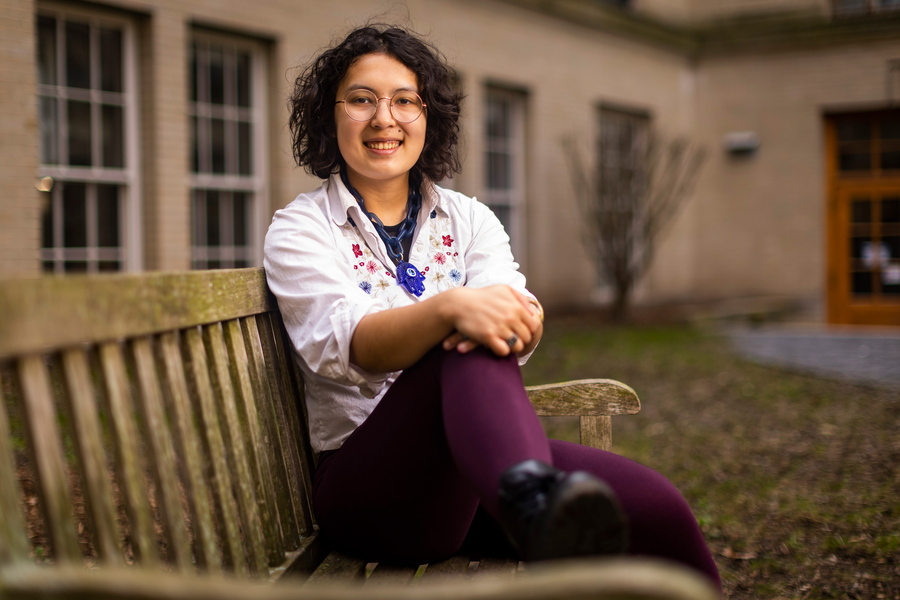

{: style="float: right; width : 30%; padding-left : 10px"}

I'm a PhD candidate at the University of Washington advised by [Lindah Kotut](https://faculty.washington.edu/kotut/) and [Catherine D'Ignazio](https://kanarinka.com/). My research tries to broadly understand how we can use data and build technology in more just and sustainable ways for and with marginalized communities. I'm particularly interested in working with activists and understanding how to use climate justice to better design technology. 

I'm also a research affiliate with the [Data + Feminism Lab at MIT](https://dataplusfeminism.mit.edu/) and [Graduate Fellow at the Center for Environmental Politics at UW](https://envirpol.org/). I'm supported by an NSF Graduate Research Fellowship and University of Washington Graduate School’s Office of Graduate Student Equity & Excellence.

Previously, I got my undergraduate degree at MIT in Urban Planning with Computer Science and American Studies. I've also interned at Lawrence Livermore National Lab, Google, among other places.

### Updates

* Dec 2025: I'll be at AGU 2025 presenting ["Radical Imagination as a Tool for Envisioning Climate Technology Futures"](https://agu.confex.com/agu/agu25/meetingapp.cgi/Paper/1988656) about my ongoing work [Front and Centered](https://frontandcentered.org/). 
* Oct 2025: Forthcoming paper with [Nikko Stevens](https://nikkistevens.com/) and [Catherine D'Ignazio](https://kanarinka.com/) about [trans activists' approaches to data](https://dl.acm.org/doi/abs/10.1145/3757682) got an honorable mention and DEI recognition at CSCW '25, and I'll be [presenting](https://programs.sigchi.org/cscw/2025/program/session/213515) it in Norway! The companion paper is also live on [Big Data & Society](https://journals.sagepub.com/doi/full/10.1177/20539517251381694). I also got an [AGU](https://www.agu.org/annual-meeting) student travel grant to present "Radical Imagination as a Tool for Envisioning Climate Technology Futures" with [Nino Migineishvili](https://www.nino-m.com/), Isabel Carrera Zamanillo, and Lindah Kotut at AGU in December.
*  Aug 2025: I, along with Lindah Kotut, got to talk to [UW News](https://www.washington.edu/news/2025/08/19/what-can-ai-developers-learn-from-climate-activists/) about our recent paper about AI, developers, and advocates. I'll also be volunteering at 4S in September and presenting a paper at CSCW in October. 
* July 2025: [Paper](https://dl.acm.org/doi/10.1145/3715336.3735734) about AI for sustainability developers and environmental/climate advocates published at [DIS](https://dis.acm.org/2025/). Another, [short paper](https://dl.acm.org/doi/10.1145/3715335.3736315) with Meira Gilbert and [Lindah Kotut](https://faculty.washington.edu/kotut/) about scams and user detection and responses strategies at [COMPASS](https://compass.acm.org/), plus an [interactive demo](https://dl.acm.org/doi/10.1145/3715335.3736310) about water with many delightful collaborators.
* June 2025: I passed my general exam this quarter. I also am co-organizing a workshop on [care at Creativity and Cognition](https://sites.google.com/view/intdesign-as-a-form-of-care) on June 23. In July, I'll be attending the [Diverse Intelligences Summer Insitute](https://disi.org/) in Scotland. 
*  Apr 2025: I'll be at CHI 2025 attending a [workshop about](https://pointed-waterlily-f95.notion.site/Post-growth-HCI-15dec6ab184b809b8692ec6a3d578089?pvs=4) post-growth thinking about [emergent strategy principles](https://drive.google.com/file/d/1M23AiJ-FE4KrV9SaSMCvS-pu6rCSvl3l/view) with my co-author [Nino Migineishvili](https://www.nino-m.com/). Also had my paper "Down to Earth": Design Considerations for AI for Sustainability from the Environmental and Climate Movement with [Hongjin Lin](https://sites.google.com/g.harvard.edu/hongjinlin) and [Lindah Kotut](https://faculty.washington.edu/kotut/) conditionally accepted to DIS 2025.
* March 2025: I was awarded an University of Washington [Program on Climate Change Climate Solutions Fund](https://pcc.uw.edu/research/funding-opportunities/) for future design workshops with [Front and Centered](https://frontandcentered.org/)
* Feb 2025: I wrote a [book review](https://networks.h-net.org/group/reviews/20058590/dogan-keilty-queer-data-studies) on Queer Data Studies edited by Patrick Keilty for H-Sci-Med-Tech. I published a working paper with Laura Frye-Levine and Ava Malysa, an undergraduate I mentored, entitled ["A Taxonomy for Social Sustainability in Corporate Communication"](https://dspace.mit.edu/handle/1721.1/158181). 
* Jan 2025: I'll be at [GROUP](https://group.acm.org/conferences/group25/papers.php) presenting my design fiction (in collaboration with Lindah Kotut) about what a [grassroots climate AI ecosystem](https://dl.acm.org/doi/10.1145/3701212) could look like. Also, a new journal paper in Feminist Media Studies with Catherine D'Ignazio looking at [how data activists use social media](https://doi.org/10.1080/14680777.2024.2447804).
* Dec 2024: Gave a talk at the MIT Climate and Sustainability Consortium about social sustainability in corporate sustainability reports. 
* Nov 2024: I'll be at a [workshop](https://sites.google.com/view/climatemigrationcscw/) at CSCW 2024 thinking about [co-speculation with climate advocacy](https://drive.google.com/file/d/1NCtyGRddqA5hnutc_nKGSTCLllIleFRH/view?usp=sharing) in Costa Rica. I'm also presenting a poster about [assesing cybersecurity risk in distributed energy resources](https://drive.google.com/file/d/1KMHXOkp9GNEKOkKYujAyzzBcNBFjZh6c/view?usp=sharing) at the [Clean Energy Education & Empowerment](https://c3e.org/) Poster Symposium at Stanford. 
* Oct 2024: I'm presenting a poster about design priorities of climate and environmental activists and AI for sustainability developers at the [Graduate Climate Conference](https://graduateclimateconference.github.io/).
* Sep 2024: I'm quoted along with some other Data + Feminism Lab colleagues in an article about data for LGBTQ+ communities in the [Washington Blade](https://www.washingtonblade.com/2024/09/13/how-data-helps-hurts-lgbtq-communities/)
* Sep 2024: Co-authored paper with the Data + Feminism Lab on geographies of feminicide is published in [Environment and Planning D](https://doi.org/10.1177/02637758241275961)
