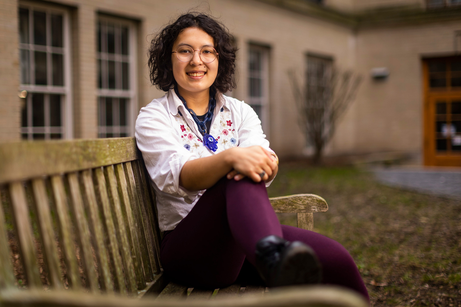

{: style="float: right; width : 30%; padding-left : 10px"}

I'm a PhD student at the University of Washington where I'm advised by [Lindah Kotut](https://faculty.washington.edu/kotut/). My research tries to broadly understand how we can use data and build technology in more just and sustainable ways for and with marginalized communities. I'm particularly interested in working with activists and understanding how to use climate justice to better design technology. 

I'm also a research affiliate with the [Data + Feminism Lab at MIT](https://dataplusfeminism.mit.edu/). I'm supported by an NSF Graduate Research Fellowship and University of Washington Graduate School’s Office of Graduate Student Equity & Excellence.

Previously, I got my undergraduate degree at MIT in Urban Planning with Computer Science and American Studies. I've also interned at Lawrence Livermore National Lab, Google, among other places.

### Updates

* Feb 2025: I wrote a [book review](https://networks.h-net.org/group/reviews/20058590/dogan-keilty-queer-data-studies) on Queer Data Studies edited by Patrick Keilty for H-Sci-Med-Tech. 
* Jan 2025: I'll be at [GROUP](https://group.acm.org/conferences/group25/papers.php) presenting my design fiction (in collaboration with Lindah Kotut) about what a [grassroots climate AI ecosystem](https://dl.acm.org/doi/10.1145/3701212) could look like. Also, a new journal paper in Feminist Media Studies with Catherine D'Ignazio looking at [how data activists use social media](https://doi.org/10.1080/14680777.2024.2447804).
* Dec 2024: Gave a talk at the MIT Climate and Sustainability Consortium about social sustainability in corporate sustainability reports. 
* Nov 2024: I'll be at a [workshop](https://sites.google.com/view/climatemigrationcscw/) at CSCW 2024 thinking about [co-speculation with climate advocacy](https://drive.google.com/file/d/1NCtyGRddqA5hnutc_nKGSTCLllIleFRH/view?usp=sharing) in Costa Rica. I'm also presenting a poster about [assesing cybersecurity risk in distributed energy resources](https://drive.google.com/file/d/1KMHXOkp9GNEKOkKYujAyzzBcNBFjZh6c/view?usp=sharing) at the [Clean Energy Education & Empowerment](https://c3e.org/) Poster Symposium at Stanford. 
* Oct 2024: I'm presenting a poster about design priorities of climate and environmental activists and AI for sustainability developers at the [Graduate Climate Conference](https://graduateclimateconference.github.io/).
* Sep 2024: I'm quoted along with some other Data + Feminism Lab colleagues in an article about data for LGBTQ+ communities in the [Washington Blade](https://www.washingtonblade.com/2024/09/13/how-data-helps-hurts-lgbtq-communities/)
* Sep 2024: Co-authored paper with the Data + Feminism Lab on geographies of feminicide is published in [Environment and Planning D](https://doi.org/10.1177/02637758241275961)
