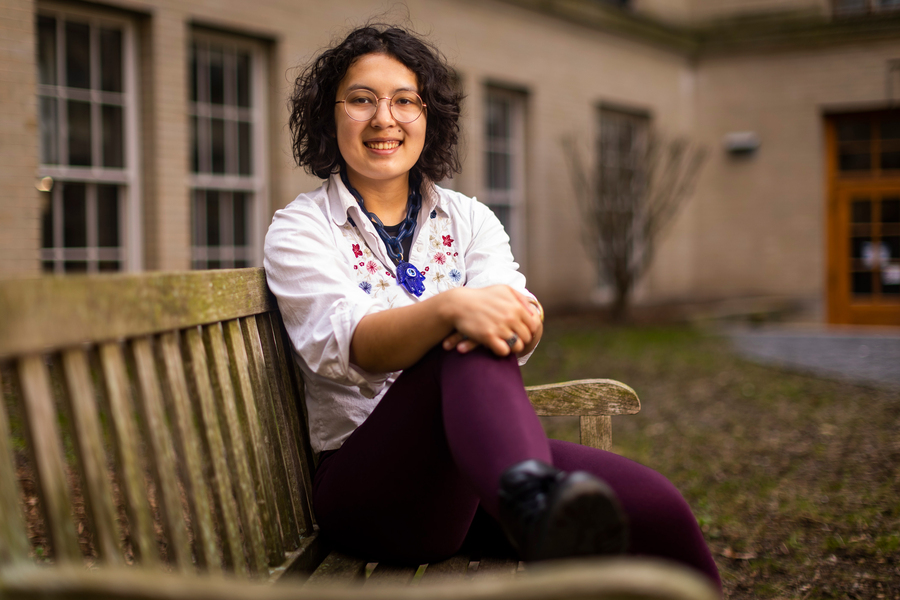

{: style="float: right; width : 30%; padding-left : 10px"}

I'm a PhD candidate at the University of Washington advised by [Lindah Kotut](https://faculty.washington.edu/kotut/) and [Catherine D'Ignazio](https://kanarinka.com/). My research tries to broadly understand how we can use data and build technology in more just and sustainable ways for and with marginalized communities. I'm particularly interested in working with activists and understanding how to use climate justice to better design technology. 

I'm also a research affiliate with the [Data + Feminism Lab at MIT](https://dataplusfeminism.mit.edu/) and [Graduate Fellow at the Center for Environmental Politics at UW](https://envirpol.org/). I'm supported by an NSF Graduate Research Fellowship and University of Washington Graduate School’s Office of Graduate Student Equity & Excellence.

Previously, I got my undergraduate degree at MIT in Urban Planning with Computer Science and American Studies. I've also interned at Lawrence Livermore National Lab, Google, among other places.

### Updates

* May 2026: I'll be [2026 NCAIS Summer Institute](https://www.newberry.org/calendar/2026-ncais-summer-institute) learning about Indigenous ecological approaches later in the summer. Excited to have a paper about environmental justice screening tools accepted at CSCW with [Soham De](https://sohamde.in/), [Ufuoma Ovienmhada](https://www.itsufuoma.com/), and [Lindah Kotut](https://faculty.washington.edu/kotut/), and be organizing a workshop (with many many) brilliant collaborators around environmental and climate justice work in HCI and CSCW engaging frontline communities. 
* April 2026: I was at CHI 2026 co-organizing a [feminist meet-up](https://dl.acm.org/doi/10.1145/3772363.3778787), presenting two workshop papers on ongoing work [around climate](https://drive.google.com/file/d/11LT43vo8uEgcl8ouPPpMS3VwRnty45oJ/view?usp=sharing) and [technology](https://hci-terra.github.io/assets/submissions/CHI_2026_HCI_TERRA_Migineishvili.pdf), and [co-authored a paper](https://dl.acm.org/doi/10.1145/3772318.3790410) about design workshops and water with colleagues at University of Toronto. 
* Dec 2025: I'll be at AGU 2025 presenting ["Radical Imagination as a Tool for Envisioning Climate Technology Futures"](https://agu.confex.com/agu/agu25/meetingapp.cgi/Paper/1988656) about my ongoing work [Front and Centered](https://frontandcentered.org/). 
* Oct 2025: Forthcoming paper with [Nikko Stevens](https://nikkistevens.com/) and [Catherine D'Ignazio](https://kanarinka.com/) about [trans activists' approaches to data](https://dl.acm.org/doi/abs/10.1145/3757682) got an honorable mention and DEI recognition at CSCW '25, and I'll be [presenting](https://programs.sigchi.org/cscw/2025/program/session/213515) it in Norway! The companion paper is also live on [Big Data & Society](https://journals.sagepub.com/doi/full/10.1177/20539517251381694). I also got an [AGU](https://www.agu.org/annual-meeting) student travel grant to present "Radical Imagination as a Tool for Envisioning Climate Technology Futures" with [Nino Migineishvili](https://www.nino-m.com/), Isabel Carrera Zamanillo, and Lindah Kotut at AGU in December.
*  Aug 2025: I, along with Lindah Kotut, got to talk to [UW News](https://www.washington.edu/news/2025/08/19/what-can-ai-developers-learn-from-climate-activists/) about our recent paper about AI, developers, and advocates. I'll also be volunteering at 4S in September and presenting a paper at CSCW in October. 
* July 2025: [Paper](https://dl.acm.org/doi/10.1145/3715336.3735734) about AI for sustainability developers and environmental/climate advocates published at [DIS](https://dis.acm.org/2025/). Another, [short paper](https://dl.acm.org/doi/10.1145/3715335.3736315) with Meira Gilbert and [Lindah Kotut](https://faculty.washington.edu/kotut/) about scams and user detection and responses strategies at [COMPASS](https://compass.acm.org/), plus an [interactive demo](https://dl.acm.org/doi/10.1145/3715335.3736310) about water with many delightful collaborators.
* June 2025: I passed my general exam this quarter. I also am co-organizing a workshop on [care at Creativity and Cognition](https://sites.google.com/view/intdesign-as-a-form-of-care) on June 23. In July, I'll be attending the [Diverse Intelligences Summer Insitute](https://disi.org/) in Scotland. 

