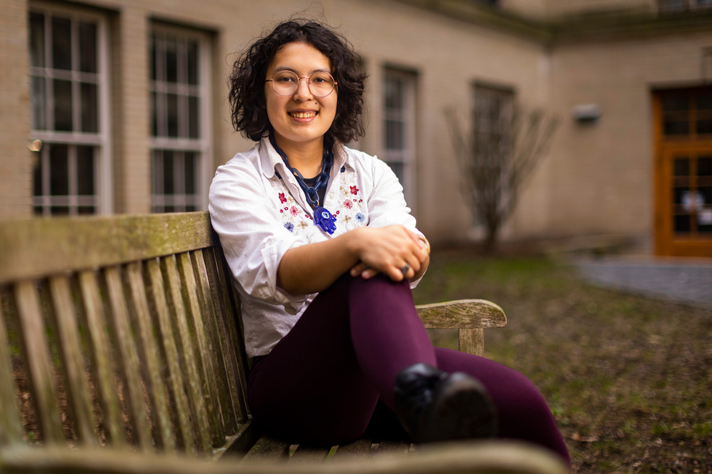

{: style="float: right; width : 30%; padding-left : 10px"}

I'm a PhD candidate at the University of Washington advised by [Lindah Kotut](https://faculty.washington.edu/kotut/) and [Catherine D'Ignazio](https://kanarinka.com/). My research tries to broadly understand how we can use data and build technology in more just and sustainable ways for and with marginalized communities. I'm particularly interested in working with activists and understanding how to use climate justice to better design technology. 

I'm also a research affiliate with the [Data + Feminism Lab at MIT](https://dataplusfeminism.mit.edu/). I'm supported by an NSF Graduate Research Fellowship and University of Washington Graduate School’s Office of Graduate Student Equity & Excellence.

Previously, I got my undergraduate degree at MIT in Urban Planning with Computer Science and American Studies. I've also interned at Lawrence Livermore National Lab, Google, among other places.

### Updates

* Oct 2026: I'll be at CSCW presenting my paper on [environmental justice screening tools](https://dl.acm.org/doi/10.1145/3816929). Also, excited to be working on a grant awarded from the [WA OSPI](https://ospi.k12.wa.us/policy-funding/grants-management/oer-development-funding) on developing middle school water related data science curriculum with the Puget Sound Educational School District and Front and Centered + got more funding for future work on community storytelling around environmental justice with small grants from the UW Community-Engaged Computing Intiative ($5k) and Resilience and Compassion Seed Grant ($5k) with [Nino Migineishvili](https://www.nino-m.com/). 
* Sept 2026: I recently passed my dissertation proposal! I also had a chance to publish with B. Biira on [assumptions we make about time](https://arxiv.org/abs/2606.13138) in computing at [LIMITS](https://computingwithinlimits.org/2026/). 
* June 2026: I'll be in Singapore attending [DIS](https://dis.acm.org/2026/)-- attending Doctoral Consortium, presenting some of my doctoral work titled "[Visions and Practices of Emerging and Current Climate Technologies from the Pacific Northwest Environmental and Climate Justice Movement"](https://dl.acm.org/doi/full/10.1145/3802974.3807995) and partaking in a [workshop](https://reworldingmth.wordpress.com/). In August, I'll be attending the [Spatial Scholarship Field School 2026](https://sites.gatech.edu/sts-fieldschool/fieldschool/): “Spatial Technologies in the Normal City” in Atlanta at Georgia Tech.
* May 2026: I'll be at the [2026 NCAIS Summer Institute](https://www.newberry.org/calendar/2026-ncais-summer-institute) learning about Indigenous ecological approaches later in the summer. Excited to have a paper about environmental justice screening tools accepted at CSCW with [Soham De](https://sohamde.in/), [Ufuoma Ovienmhada](https://www.itsufuoma.com/), and [Lindah Kotut](https://faculty.washington.edu/kotut/), and be [organizing a workshop](https://ecjcscw2026workshop.netlify.app/) (with many many) brilliant collaborators around environmental and climate justice work in HCI and CSCW engaging frontline communities. 
* April 2026: I was at CHI 2026 co-organizing a [feminist meet-up](https://dl.acm.org/doi/10.1145/3772363.3778787), presenting two workshop papers on ongoing work [around climate](https://drive.google.com/file/d/11LT43vo8uEgcl8ouPPpMS3VwRnty45oJ/view?usp=sharing) and [technology](https://hci-terra.github.io/assets/submissions/CHI_2026_HCI_TERRA_Migineishvili.pdf), and [co-authored a paper](https://dl.acm.org/doi/10.1145/3772318.3790410) about design workshops and water with colleagues at University of Toronto. 
